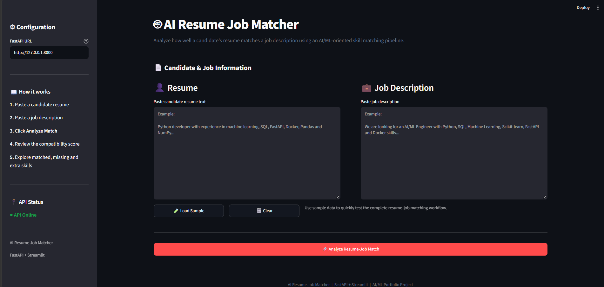

# 🤖 AI Resume Job Matcher

> An end-to-end AI/ML portfolio project that analyzes a candidate's resume against a job description, identifies matching and missing skills, and provides an explainable compatibility score through a FastAPI backend and Streamlit dashboard.

---

## 🚀 Overview

The **AI Resume Job Matcher** is a production-oriented resume-to-job matching platform designed to demonstrate an end-to-end AI/ML application workflow.

The system accepts:

- Candidate resume text
- Job description text

It then processes the inputs through a matching pipeline and returns:

- Overall match percentage
- Matched skills
- Missing skills
- Extra candidate skills
- Skill score
- Pipeline status
- Candidate and job summary

The application provides both a **REST API** and an interactive **Streamlit dashboard**.

---

## 📸 Dashboard Preview

The Streamlit dashboard provides an interactive interface for analyzing resume–job compatibility, viewing skill gaps, and reviewing the matching results.



---

---

## ✨ Key Features

### 📄 Resume & Job Input

- Resume text input
- Job description input
- Sample data loading
- Clear/reset functionality
- Session-state based dashboard interaction

### 🎯 Resume–Job Matching

- Skill extraction and comparison
- Matched skill identification
- Missing skill identification
- Extra skill identification
- Compatibility score calculation
- Skill score reporting

### 🌐 FastAPI Backend

- REST API architecture
- `/health` health-check endpoint
- `/match` matching endpoint
- Pydantic request/response schemas
- Request validation
- Structured error responses
- Exception handling
- Swagger/OpenAPI documentation

### 📊 Streamlit Dashboard

- Interactive web interface
- FastAPI connectivity
- API health indicator
- Resume/job text areas
- Sample data button
- Compatibility score visualization
- Skill analysis
- Pipeline information
- Raw API response viewer
- JSON result download

### 🧪 Testing

The project includes automated tests covering important API and pipeline functionality.

Current verified test result:

```text
17 passed, 2 warnings
The warnings are dependency deprecation warnings and do not currently cause test failures.
🏗️ System Architecture
                    ┌───────────────────────┐
                    │      User Input       │
                    │                       │
                    │  Resume + Job Desc.   │
                    └───────────┬───────────┘
                                │
                                ▼
                    ┌───────────────────────┐
                    │ Streamlit Dashboard   │
                    │                       │
                    │ - Input UI            │
                    │ - Results UI          │
                    │ - API Status          │
                    └───────────┬───────────┘
                                │
                                │ HTTP POST /match
                                ▼
                    ┌───────────────────────┐
                    │    FastAPI Backend    │
                    │                       │
                    │ - Validation          │
                    │ - API Schemas         │
                    │ - Error Handling      │
                    └───────────┬───────────┘
                                │
                                ▼
                    ┌───────────────────────┐
                    │ Matching Pipeline     │
                    │                       │
                    │ - Preprocessing       │
                    │ - Skill Extraction    │
                    │ - Matching            │
                    │ - Scoring             │
                    └───────────┬───────────┘
                                │
                                ▼
                    ┌───────────────────────┐
                    │     Match Result      │
                    │                       │
                    │ - Match %             │
                    │ - Matched Skills      │
                    │ - Missing Skills      │
                    │ - Extra Skills        │
                    │ - Skill Score         │
                    └───────────────────────┘
```

## 🧠 Matching Workflow

Resume Text
     │
     ▼
Text Preprocessing
     │
     ▼
Skill Extraction
     │
     ├───────────────┐
     │               │
     ▼               ▼
Resume Skills    Job Skills
     │               │
     └───────┬───────┘
             ▼
       Skill Comparison
             │
      ┌──────┼──────┐
      ▼      ▼      ▼
   Matched Missing Extra
      │      │      │
      └──────┼──────┘
             ▼
       Score Calculation
             │
             ▼
       FastAPI Response
             │
             ▼
      Streamlit Dashboard

## 🛠️ Technology Stack

Programming
Python
Data Processing
Pandas
NumPy
Machine Learning / Matching
Scikit-learn
Skill-based matching
Feature preprocessing
Scoring pipeline
Backend
FastAPI
Pydantic
Uvicorn
Frontend / Dashboard
Streamlit
HTML/CSS customization
Testing
Pytest
Development Tools
Git
GitHub
Jupyter Notebook
VS Code

## 📁 Project Structure

ai-resume-job-matcher/
│
├── api/
│   ├── main.py
│   ├── schemas.py
│   └── routes/
│       ├── assistant.py
│       ├── health.py
│       ├── jobs.py
│       ├── matching.py
│       └── resume.py
│
├── dashboard/
│   └── app.py
│
├── data/
│   └── raw/
│
├── genai/
│   ├── assistant.py
│   └── schemas.py
│
├── sql/
│
├── src/
│   ├── embeddings/
│   ├── extraction/
│   ├── ingestion/
│   ├── matching/
│   ├── pipeline/
│   ├── preprocessing/
│   ├── scoring/
│   └── utils/
│
├── tests/
│   ├── api/
│   ├── extraction/
│   ├── ingestion/
│   ├── matching/
│   ├── pipeline/
│   ├── preprocessing/
│   └── scoring/
│
├── .gitignore
├── LICENSE
├── README.md
└── requirements.txt

## ⚙️ Installation

1. Clone the repository
git clone https://github.com/aaishish-ml/ai-resume-job-matcher.git

2. Enter the project directory
cd ai-resume-job-matcher

3. Create a virtual environment
Windows
python -m venv .venv
Activate it:
.venv\Scripts\activate
macOS / Linux
python3 -m venv .venv
source .venv/bin/activate

4. Install dependencies
pip install -r requirements.txt

## ▶️ Running the Application

The project uses two services:
FastAPI backend
Streamlit dashboard

1. Start FastAPI
From the project root:
uvicorn api.main:app --reload
The API will run at:
http://127.0.0.1:8000
Swagger documentation:
http://127.0.0.1:8000/docs

2. Start Streamlit
Open another terminal and activate the virtual environment.
Then run:
streamlit run dashboard/app.py
The dashboard will normally open at:
http://localhost:8501

## 🔌 API Endpoints

Health Check
GET /health
Example response:
{
    "status": "healthy",
    "service": "ai-resume-job-matcher"
}
Resume–Job Matching
POST /match
Request:
{
    "resume_text": "Python developer with experience in machine learning, SQL, FastAPI and Docker.",
    "job_description": "Looking for an AI/ML Engineer with Python, SQL, Machine Learning, FastAPI and Docker skills."
}
Example response:
{
    "resume_name": "Candidate resume",
    "job_title": "AI/ML Engineer",
    "match_percentage": 83.33,
    "matched_skills": [
        "docker",
        "fastapi",
        "machine learning",
        "python",
        "sql"
    ],
    "missing_skills": [
        "scikit-learn"
    ],
    "extra_skills": [
        "numpy",
        "pandas"
    ],
    "matched_count": 5,
    "missing_count": 1,
    "extra_count": 2,
    "skill_score": 83.33,
    "skill_score_max": 100,
    "pipeline_status": "success"
}
The exact result depends on the resume and job description supplied to the API.

## 📊 Dashboard Workflow

The Streamlit dashboard follows this workflow:

1. Open Dashboard
        ↓
2. Check API Status
        ↓
3. Enter Resume
        ↓
4. Enter Job Description
        ↓
5. Analyze Resume–Job Match
        ↓
6. FastAPI processes request
        ↓
7. Matching pipeline runs
        ↓
8. Results displayed
        ↓
9. Review skill gaps
        ↓
10. Download JSON result

The dashboard also provides a Load Sample option for quickly testing the complete workflow.

## 🧪 Testing

Run the complete test suite:
python -m pytest -q
Current verified result:
17 passed, 2 warnings
The test suite covers multiple components including:
API behavior
Input validation
Extraction
Ingestion
Matching
Pipeline
Preprocessing
Scoring

## 🔐 Input Validation

The API validates incoming requests using Pydantic schemas.
For example, empty or whitespace-only inputs are rejected.
Example:
{
    "error": "validation_error",
    "message": "Request validation failed."
}
This prevents invalid requests from entering the matching pipeline.

## 📈 Example Result

For a sample resume containing:
Python
SQL
Machine Learning
FastAPI
Docker
Pandas
NumPy
and a job description requiring:
Python
SQL
Machine Learning
Scikit-learn
FastAPI
Docker
the system can identify:
Matched:
✓ Python
✓ SQL
✓ Machine Learning
✓ FastAPI
✓ Docker

Missing:
⚠ Scikit-learn

Extra:
+ Pandas
+ NumPy
The dashboard then presents the result through metrics, progress visualization and skill tags.

## 🎯 Project Goals

This project was designed to demonstrate practical AI/ML engineering skills including:
Python development
Data preprocessing
Feature engineering
Machine learning workflow
Skill matching
Model/scoring evaluation
REST API development
FastAPI
Streamlit
Automated testing
Git/GitHub
Modular project architecture
Production-oriented development practices

## 🔮 Future Improvements
Potential future improvements include:
PDF resume upload
DOCX resume support
Automated resume text extraction
Semantic embedding-based matching
Sentence-transformer integration
LLM-powered resume analysis
Explainable AI recommendations
Job recommendation engine
Resume improvement suggestions
ATS optimization
Database-backed candidate history
Authentication
Docker deployment
CI/CD pipeline
Cloud deployment
Advanced analytics dashboard
## 🧩 Engineering Highlights
This project follows a modular architecture rather than keeping the complete application inside a single notebook or script.
Key engineering decisions include:
Separate API layer
Separate dashboard layer
Modular source code
Dedicated Pydantic schemas
Centralized matching pipeline
Automated tests
Environment-variable protection
Git-based version control
Structured error handling
This makes the project easier to test, maintain and extend.

## 📌 Current Project Status
✅ FastAPI backend
✅ Streamlit dashboard
✅ Resume/job matching
✅ Skill gap analysis
✅ API validation
✅ Error handling
✅ Swagger documentation
✅ Automated tests
✅ Git repository
✅ GitHub repository
✅ Sample workflow

## 👨‍💻 Author

Aashish
AI/ML & Data Analytics Student
Python | Machine Learning | Data Analysis | FastAPI | Streamlit

## 📄 License
This project is licensed under the license included in this repository.
